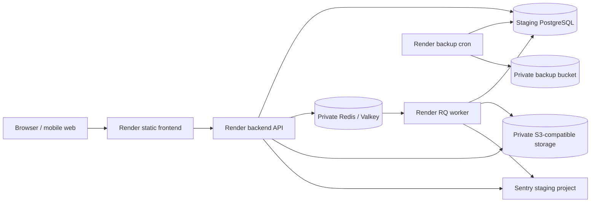

# Nexus Analytics staging deployment

## Architecture

The frontend, API, worker, PostgreSQL, Redis and buckets must be staging-only
resources. Nothing in staging may point at production data or secrets.

## Runtime commands

- API: `uvicorn ai_service:app --host 0.0.0.0 --port $PORT --proxy-headers`
- Worker: `python -m backend.worker`
- Safe migration: `python -m data.migrate`
- Daily backup: `python -m scripts.backup_postgres`
- Restore drill: `python -m scripts.restore_postgres`

The API never starts an infinite worker loop. RQ jobs are persisted in Redis and
business status is also stored in `background_jobs`, `import_jobs`,
`export_jobs`, and `notifications`.

## Required configuration

Copy keys from `.env.example`. For `APP_ENV=staging`, startup intentionally fails
unless all of these are present:

- `DATABASE_URL`: dedicated PostgreSQL URL.
- `REDIS_URL`: private internal Redis/Valkey URL.
- `STORAGE_BACKEND=s3`, `S3_BUCKET`, `S3_REGION`; endpoint and access keys when
  workload identity is unavailable.
- `SENTRY_DSN`: staging project only.
- `CORS_ORIGINS`: exact HTTPS frontend origin.
- `JWT_SECRET`: unique 32+ character server-only secret.
- `PUBLIC_API_BASE_URL`: public HTTPS API origin, used only by the static build.

Use separate upload/export and backup buckets, private by default. Apply bucket
lifecycle rules matching `OBJECT_RETENTION_DAYS` (default 30 days) for source and
export objects. Backups have a separate 30-daily/12-monthly retention policy.

## Provision and deploy

1. Create the external private S3-compatible buckets and staging Sentry project.
2. Create a Render Blueprint from `render.yaml`.
3. Fill all `sync: false` values. Do not copy production credentials.
4. Confirm frontend and backend URLs, then set `CORS_ORIGINS` and
   `PUBLIC_API_BASE_URL` to those exact HTTPS origins.
5. Allow CI gates to pass. `autoDeployTrigger: checksPass` prevents deployment on
   failing checks.
6. The API pre-deploy command applies additive migrations. It never drops or
   resets schema. Verify `/health/live` and `/health/ready` after deployment.
7. Confirm an RQ worker heartbeat in Redis and run the real staging smoke/E2E
   suite before declaring staging usable.

No deployment was performed as part of Phase 6B because no deployment
authorization or staging credentials were supplied.

## Migration validation

CI uses a real PostgreSQL service and performs both paths:

1. clean schema -> migrations 001 through current -> restart with no new work;
2. clean schema -> migrations 001-006 -> current migration -> restart.

`schema_migrations` stores file checksums and refuses modified applied files.
Local SQLite remains supported for lightweight development.

## Health and failure behavior

- `/health/live` only proves that the API process can respond.
- `/health/ready` checks PostgreSQL, Redis, and private object storage. Any failed
  required dependency returns HTTP 503.
- Sensitive rate limiting fails closed when Redis is unavailable.
- Queue submission returns HTTP 503 and records a failed durable job when Redis
  cannot accept work.
- RQ retries export/import/notification jobs up to three times. SIGTERM requests
  graceful worker shutdown; interrupted jobs remain recoverable through RQ.

Worker health is its Redis heartbeat (`rq:worker:*`), monitored externally. Alert
if no staging worker heartbeat exists for 90 seconds, or if failed-job count,
import failures or export failures rises.

## Logging and monitoring

API logs are JSON and include request ID, route, status, duration and safe
workspace/user identifiers when an authenticated mutation resolves. Job logs
include job ID/type, correlation ID, workspace, status and duration. Passwords,
cookies, authorization headers, tokens, secrets and raw imported rows are not
logged. Sentry scrubbing filters sensitive keys and default PII collection is off.

Frontend errors are reduced to message, page and component before the backend
captures them in the staging Sentry environment. Raw request payloads are not
forwarded.

## Security notes

- CORS uses an exact staging origin and credentialed cookies.
- Cookies remain HttpOnly/Secure under the staging HTTPS deployment policy.
- Workspace IDs are enforced by existing server-side repository queries/guards.
- Objects are never made public; downloads require workspace authorization and
  use a five-minute signed URL.
- Generated object keys prevent client path control and overwrite across
  workspaces.
- Spreadsheet formula execution remains disabled by ingestion validation.
- The approved UI currently contains inline `style` attributes, so CSP retains
  `style-src 'unsafe-inline'`. Scripts do not allow `unsafe-inline`.
- Malware scanning is not implemented. It is acceptable only for controlled
  internal staging and is a blocker before broad public upload exposure.

## Staging smoke checklist

Run against the deployed URLs without mocks: register/login, workspace access,
CSV upload, preview, mapping, queued import, Overview, revenue/funnel/retention/
cohort/segment, saved view, alert, queued export/download, notification, logout
and login persistence. Then test unavailable Redis/storage/database, worker
restart, failed export, invalid upload, duplicate import and cross-workspace
access. Preserve run URL, commit SHA, timestamps, request IDs and job IDs as
evidence.
